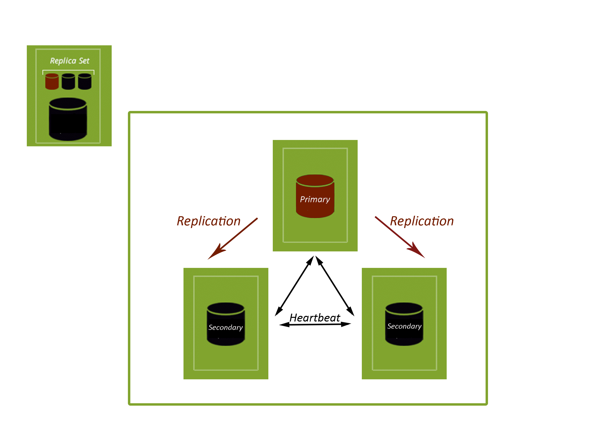

# Google Cloud Environment - MongoDB Sharded Cluster Deployment (3-shard-replicaset,2-routers, 1-config-replicaset)


## How To Deploy

### 1. Prerequisites

- An account has been registered with the Google Compute Platform (GCP). [Sing up free here](https://cloud.google.com/free/).

-  Sign-in to Google Cloud Platform console (console.cloud.google.com) and create a new project. Remember the project ID, a unique name across all Google Cloud projects (the name above has already been taken and will not work for you, sorry!). It will be referred to later in this guide as PROJECT_ID.
 
- Next, you'll need to enable billing in the Developers Console in order to use Google Cloud resources like Cloud Datastore and Cloud Storage.

**NOTE:** You have the option of create a project using gcloud config, but, to get $300 of free credit, you must use your browser and search a bit, maybe you can find it using this [link ](https://cloud.google.com/free/docs/gcp-free-tier). Good luck! ☘️ 

- Navigate to the the Google Cloud Console from a browser tab/window, to [link](https://console.cloud.google.com). Use the login credential given to you by the lab proctor. We have to 
search for "Google Container Engine API" in the search box. Then, click "Enable".


- Google Cloud client command line on local. [Download here](https://cloud.google.com/sdk/docs/quickstarts).
- Your local has been initialised to: 

1. Use your Google Cloud account. 
2. Install the Kubernetes command tool (“kubectl”).
3. Config authentication.
4. Config the default zone to be deployed to (Europe-West for us):

```
gcloud init
gcloud components install kubectl
gcloud auth application-default login
gcloud config set compute/zone europe-west1-b
```
You could set the default zone to another, using one of` gcloud compute zones list`. This command shows a list of the available zones.


### 2. Deployment

Using the folder named "scripts", and file "generate.sh" (you must change the password):

```
cd scripts
./generate.sh
```
It would take several minutes, be patience.
Once completed, you sould have a MongoDB Sharded Cluster.

* 1 Config Server Replica Set containing 3 replicas.
* 3 Shards with each Shard being a Replica Set containing 3 replicas
* 2 Mongos Routers

-----
**Note:** What is a Replica Set?



-----

To view the state of the deployed environment on the browser, [Google Cloud Platform Console](https://console.cloud.google.com) looking into “Kubernetes Engine” and the “Compute Engine” sections of the Console. You could select them like favorites to visualize better these options. 

```
mongos-router-0.mongos-router-service.default.svc.cluster.local:27017

mongos-router-1.mongos-router-service.default.svc.cluster.local:27017

```

### 3. Testing


You could view the list of Pods of MongoDB resources, by running the next:

``` 
kubectl get pods
```


To test and analise that the sharded cluster is working adecually, connect to the first "mongos" (router), then use the Mongo shell to login, enable sharding on a collection, add test data to this collection and later view the status of the sharded cluster and collection:

```
kubectl exec -it mongos-router-0 -c mongos-container bash
mongo
db.getSiblingDB('admin').auth("main_admin", "YOUR-PASSWORD");
sh.enableSharding("test");
sh.shardCollection("test.testcollection", {"first": 1});
use test;
show collections;
db.testcollection.insert({"first": "a", "second": "b"});
db.testcollection.find();
sh.status();
db.testcollection.drop();
db.dropDatabase();
show dbs;
```

---

**NOTE:** What is Sharding? → Chunk concept:


---

### 4. Cleaning

**NOTE:** This step is required to be sure you are NOT PAYING CONTINOUSLY using some resource created using this deployment guide.

Execute the next script to clean the MongoDB arquitecture plus related Kubernetes resources, followed by the removal of the disks before finally deleting the Kubernetes cluster.

```
./teardown.sh
```
Checking in the [Google Cloud Platform Console](https://console.cloud.google.com), to ensure all resources have been removed.

**WARNING:** Google has done obligatory the use of storage disk as minimum 10GB. It will be necesary change some .yaml and inside ./generate.sh option --size for disks creation. Be sure your zone is correctly configured or specify it with the command --zone=eu-west1-b, for example. (It will be update in next versions).

---
---
---

MASTERING MARKDOWN: [Visit this website](https://guides.github.com/features/mastering-markdown/) 


----
Based on the content provided by [k8smongodb.net](https://k8smongodb.net)

